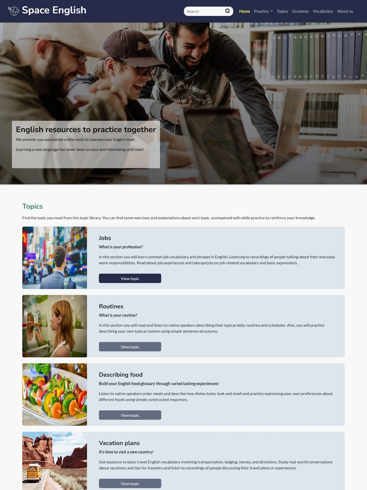
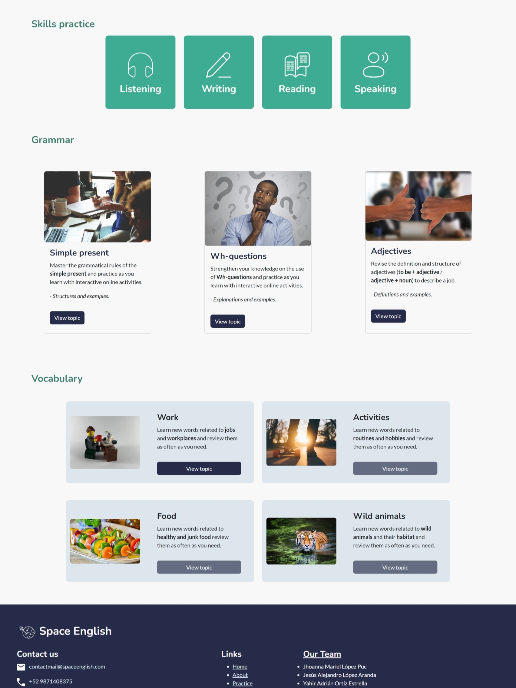

# Space English: English Learning Website

Space English is an educational website oriented to help students to practice their English skills and vocabulary.

## 🔗 Live preview: https://space-english.netlify.app/

## Screenshots

    
    

## 🖱️Website features

Space English included online resources to practice English Learning online through interactive activities, multimedia content, and topic-related navigation. Students navigate the site using the topics, and following the sections, which included a variety of activities for each English language skill.

- Topic selection
- Categorized navigation
- Multimedia content
- Embedded activities
- Responsive design

## ⚙️Technological features
To build this website, the follwing web technologies were used:

- 
        HTML
-  CSS
-  Bootstrap styles and components
-  JavaScript